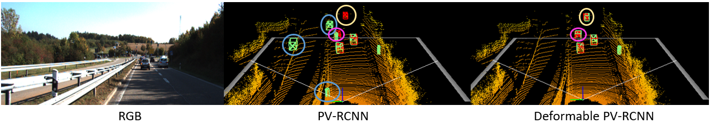

# Deformable PV-RCNN: Improving 3D Object Detection with Learned Deformations

By [Prarthana Bhattacharyya](https://scholar.google.com/citations?user=v6pGkNQAAAAJ&hl=en) and [Krzysztof Czarnecki](https://scholar.google.com/citations?hl=en&user=ZzCpumQAAAAJ).

We provide code support and configuration files to reproduce the results in the paper for
["Deformable PV-RCNN: Improving 3D Object Detection with Learned Deformations"](https://arxiv.org/abs/2008.08766) on KITTI 3D object detection. Our code is based on [OpenPCDet](https://github.com/open-mmlab/OpenPCDet), which is a clean open-sourced project for benchmarking 3D object detection methods. 


## Introduction

<div align="center">
  
  <p>Learning Deformations in 3D Object Detection.</p>
</div>

**Deformable PV-RCNN** is a high-performing point-cloud based 3D object detector. Currently, the proposal refinement methods used by the state-of-the-art two-stage detectors cannot adequately accommodate differing object scales, varying point-cloud density, part-deformation and clutter. We present a proposal refinement module inspired by 2D deformable convolution networks that can adaptively gather instance-specific features from locations where informative content exists. We also propose a simple context gating mechanism which allows the keypoints to select relevant context information for the refinement stage. We outperform previously published methods on the highly competitive KITTI 3D Object Detection benchmark on cars and cyclists.


## Demo

<div align="center">
  
  <p>Visualizing PV-RCNN and Deformable PV-RCNN results.</p>
</div>


## Usage
a. Clone the repo:
```
git clone --recursive https://github.com/AutoVision-cloud/Deformable-PV-RCNN
```
b. Copy Deformable PV-RCNN src into OpenPCDet: 
```
sh ./init.sh
```

c. Install OpenPCDet and prepare KITTI data:

Please refer to [INSTALL.md](docs/INSTALL.md) for installation and dataset preparation.

d. Run experiments with a specific configuration file:

Please refer to [GETTING_STARTED.md](docs/GETTING_STARTED.md) to learn more about how to train and run inference on this detector.


## Results and models

The 3D AP results on KITTI 3D Object Detection validation split of the moderate category are shown in the table below.

|                                                     | Car | Pedestrian | Cyclist  | download | 
|-----------------------------------------------------|:-------:|:-------:|:-------:|:---------:|
| [PV-RCNN](https://github.com/open-mmlab/OpenPCDet/blob/b32fbddbe06183507bad433ed99b407cbc2175c2/tools/cfgs/kitti_models/pv_rcnn.yaml) | 83.69 | 54.84 | 69.47 | [model-PV-RCNN](https://drive.google.com/file/d/1CXK7LVGU9jPRcygrDReQWhpwax9BJ9hb/view?usp=sharing) |
| [Deformable PV-RCNN-v1](config/def_pv_rcnn.yaml) | 83.30 | 58.33 | 73.46 | [model-def-PV-RCNN](https://drive.google.com/file/d/18YpEEViDFjKdxhTFxo7mdGWdopCMZ28j/view?usp=sharing) |
| [Deformable PV-RCNN-v2](config/def_pv_rcnn.yaml) | 83.31 | 59.31 | 74.18 | [model-def-PV-RCNN-all](https://drive.google.com/file/d/1WVUsTYMFqc1yjJ-p_xo-BPixmLdI4HVg/view?usp=sharing) |

**Notes:**
- Our models are trained with Pytorch 1.5, 8 GTX 1080Ti GPUs and are available for download.
- `v1` denotes using Conv3 and Conv4 features for deformations.
- `v2` denotes using all convolutional features for deformations. The current configurations are set for `v2`.


The results on KITTI 3D Object Detection [test split](http://www.cvlibs.net/datasets/kitti/eval_object.php?obj_benchmark=3d) are shown in the table below.

|                                                     |  FPS | Car | Pedestrian | Cyclist  | 3D mAP
|-----------------------------------------------------|:---------:|:-------:|:-------:|:-------:|:-------:|
| [PV-RCNN](https://github.com/open-mmlab/OpenPCDet/blob/b32fbddbe06183507bad433ed99b407cbc2175c2/tools/cfgs/kitti_models/pv_rcnn.yaml) | 13 |  81.43 | 43.29 | 63.71 | 62.81
| [Deformable PV-RCNN](config/def_pv_rcnn.yaml) | 12 | 81.46 | 40.89 | 68.54 | 63.63


## Citing Deformable PV-RCNN

```
@misc{bhattacharyya2020deformable,
    title={Deformable PV-RCNN: Improving 3D Object Detection with Learned Deformations},
    author={Prarthana Bhattacharyya and Krzysztof Czarnecki},
    year={2020},
    eprint={2008.08766},
    archivePrefix={arXiv},
    primaryClass={cs.CV}
}
```


## Acknowledgement
* [second.pytorch](https://github.com/traveller59/second.pytorch)
* [PointRCNN](https://github.com/sshaoshuai/PointRCNN)
* [PV-RCNN](https://github.com/open-mmlab/OpenPCDet)
